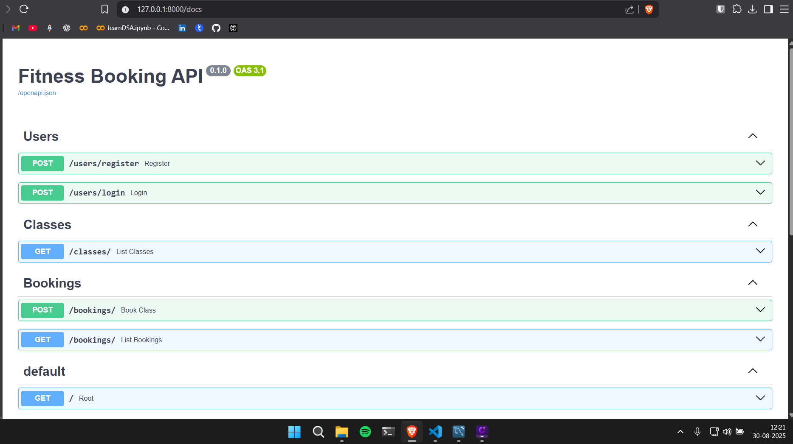

# 🏋️ Fitness Studio Booking API

A **FastAPI-based Booking API** for a fictional fitness studio.  

This project demonstrates **backend development skills** including API design, database integration, JWT authentication, and input validation.  

---



---

## 🎯 Objective

Build a **Booking API** for a fitness studio that offers classes such as **Yoga, Zumba, and HIIT**.  

Clients should be able to:

- View available upcoming classes  
- Book a spot in a class (if slots are available)  
- Retrieve all their bookings by email  

The system also handles **authentication & authorization** using **JWT**.

---

## 📌 Requirements (Implemented)

- ✔️ **POST /users/register** → Register a new user  
- ✔️ **POST /users/login** → Authenticate a user and return a **JWT token**  
- ✔️ **GET /classes** → List all upcoming classes (name, date/time, instructor, available slots)  
- ✔️ **POST /bookings** → Create a booking request (validates slot availability & reduces slots)  
- ✔️ **GET /bookings** → Get all bookings made by a client email  

---

## 🚀 Features

- 🔐 **JWT authentication** for secure booking  
- 🗄️ **SQLAlchemy ORM** with relationships (**Users, Classes, Bookings**)  
- 🛢️ **MySQL/SQLite** support  
- 🌱 **Seed data** for demo classes  
- 📑 **Automatic API docs** via FastAPI (`/docs` & `/redoc`)  

---

## 📂 Project Structure

fitness_api/
├─ app/
│ ├─ init.py
│ ├─ main.py
│ ├─ models/
│ │ ├─ init.py
│ │ ├─ classes.py
│ │ ├─ user.py
│ │ └─ booking.py
│ ├─ routers/
│ │ ├─ init.py
│ │ ├─ class_router.py
│ │ └─ booking_router.py
│ ├─ schemas/
│ │ ├─ init.py
│ │ ├─ classes.py
│ │ ├─ booking.py
│ │ └─ user.py
│ ├─ services/
│ │ ├─ init.py
│ │ ├─ database.py
│ │ ├─ class_service.py
│ │ └─ booking_service.py
│ └─ utils/
│ ├─ init.py
│ └─ timezone.py
├─ scripts/
│ └─ seed.py
├─ tests/
│ └─ test_booking.py
├─ requirements.txt
└─ README.md

yaml
Copy code

---

## 📦 Tech Stack

- **FastAPI** (Python 3.11+)  
- **SQLAlchemy + Alembic**  
- **Pydantic v2**  
- **MySQL** (with fallback to SQLite)  
- **Docker + Docker Compose**  

---

## ⚙️ Setup Instructions

### 1️⃣ Clone Repo

```bash
git clone https://github.com/YOUR_USERNAME/fitness-api.git
cd fitness-api
2️⃣ Run Locally (No Docker)
bash
Copy code
# Create virtual environment
python -m venv venv  

# Activate virtual environment
source venv/bin/activate     # Mac/Linux  
venv\Scripts\activate        # Windows  

# Install dependencies
pip install pipenv
pipenv install
3️⃣ Create Environment File
Copy .env.example → .env and configure:

ini
Copy code
DATABASE_URL=sqlite:///./fitness.db   # or MySQL if preferred
JWT_SECRET=supersecretkey
JWT_ALGORITHM=HS256
ACCESS_TOKEN_EXPIRE_MINUTES=30
4️⃣ Run FastAPI App
bash
Copy code
uvicorn app.main:app --reload
📘 API Endpoints
👤 Users
Register User
POST /users/register

Request

json
Copy code
{
  "name": "Alice Johnson",
  "email": "alice@example.com",
  "password": "password123"
}
Login (Get JWT Token)
POST /users/login

Response

json
Copy code
{
  "access_token": "eyJhbGciOiJIUzI1NiIs...",
  "token_type": "bearer"
}
🏋️ Classes
Get All Upcoming Classes
GET /classes

Response

json
Copy code
[
  {
    "id": 1,
    "name": "Morning Yoga",
    "datetime": "2025-09-01T07:00:00Z",
    "instructor": "Alice Johnson",
    "total_slots": 20,
    "available_slots": 15
  }
]
📅 Bookings
Create Booking (JWT Required)
POST /bookings

Headers

makefile
Copy code
Authorization: Bearer <JWT_TOKEN>
Request

json
Copy code
{
  "class_id": 1,
  "client_name": "Alice Johnson",
  "client_email": "alice@example.com"
}
Response

json
Copy code
{
  "id": 10,
  "class_id": 1,
  "client_name": "Alice Johnson",
  "client_email": "alice@example.com",
  "status": "confirmed"
}
Get Bookings by Email
GET /bookings?email=alice@example.com

Response

json
Copy code
[
  {
    "id": 10,
    "class_id": 1,
    "client_name": "Alice Johnson",
    "client_email": "alice@example.com",
    "status": "confirmed"
  }
]
🧪 Testing
Swagger UI 👉 http://localhost:8000/docs

ReDoc 👉 http://localhost:8000/redoc

You can also import the provided Postman collection (postman_collection.json) with pre-configured requests for:

User Registration

User Login (JWT Authentication)

Get Upcoming Classes

Create Booking

Get Bookings by Email

🧪 cURL Examples
👤 Register User
bash
Copy code
curl -X POST http://127.0.0.1:8000/users/register \
   -H "Content-Type: application/json" \
   -d '{"name": "Alice Johnson", "email": "alice@example.com", "password": "password123"}'
🔑 Login (Get JWT Token)
bash
Copy code
curl -X POST http://127.0.0.1:8000/users/login \
   -H "Content-Type: application/json" \
   -d '{"username": "alice@example.com", "password": "password123"}'
🏋️ Get All Upcoming Classes
bash
Copy code
curl -X GET "http://127.0.0.1:8000/classes/" \
   -H "accept: application/json"
📅 Book a Class (JWT Required)
bash
Copy code
curl -X POST "http://127.0.0.1:8000/bookings/" \
   -H "accept: application/json" \
   -H "Authorization: Bearer <JWT_TOKEN>" \
   -H "Content-Type: application/json" \
   -d '{"class_id": 1, "client_email": "john.doe@example.com", "client_name": "John Doe"}'
📋 List Bookings by Email
bash
Copy code
curl -X GET "http://127.0.0.1:8000/bookings/?email=alice@example.com" \
   -H "accept: application/json"